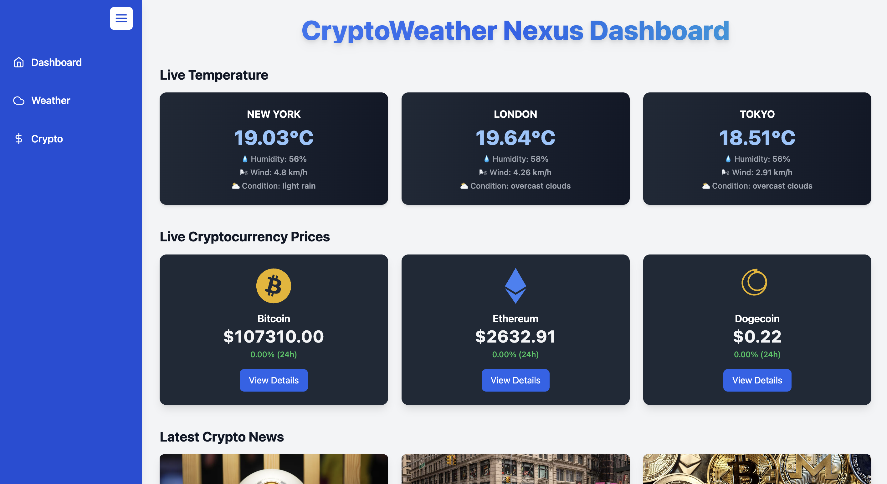
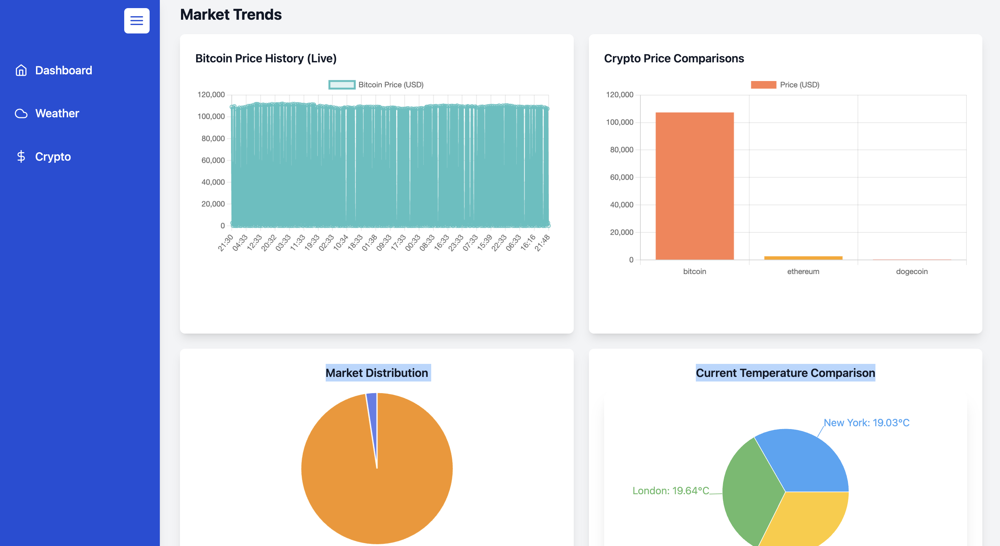
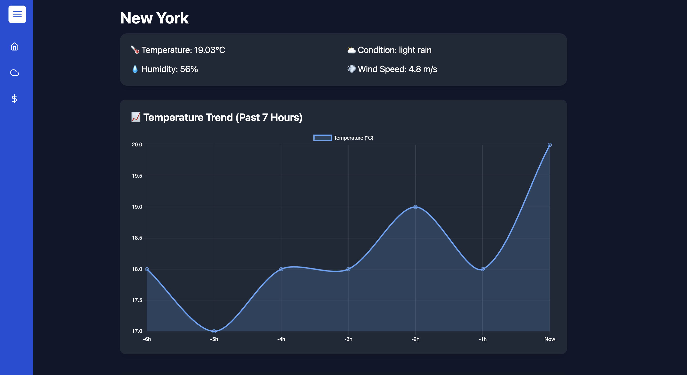

 
# 🌐 CryptoWeather Nexus: Real-Time Crypto, Weather & News Dashboard 💹☁️📰  
 
## 📖 Table of Contents
- [Overview](#-overview)
- [Features](#-features)
- [Installation](#-installation)
- [Usage](#-usage)
- [Design Decisions](#-design-decisions)
- [APIs Used](#-apis-used)
- [Contributing](#-contributing)
- [Acknowledgments](#-acknowledgments)
- [Contact](#-contact)

---

## 🔍 Overview
CryptoWeather Nexus is a modern, multi-page dashboard integrating weather data, cryptocurrency information, and real-time notifications via WebSocket. This application is designed to showcase key data dynamically and interactively while ensuring responsiveness across devices.

---

## ✨ Features

- 📈 **Live Crypto Tracking**: Real-time data from CoinGecko for BTC, ETH, DOGE.
- ☁️ **Global Weather Dashboard**: Live temperature, humidity, and forecast for cities like New York, London, and Tokyo.
- 🧠 **Historical Charting**: Uses Chart.js to visualize pricing and temperature trends.
- 🌍 **News Highlights**: Top 5 crypto-related headlines from **NewsAPI**.
- 💥 **WebSocket-Based Alerts**: Receive instant alerts on severe weather changes.
- 💻 **Responsive UI**: Built with Tailwind CSS, fully optimized for mobile and desktop.

---

<h2 id="screenshots">⚙ Screenshots</h2>
<h4>Dashboard Page</h4>



<h4>Temperature Details Page</h4>



## ⚙️ Installation

```bash
# Clone the repository
git clone (https://github.com/Dsmita03/CryptoWeather-Nexus)
cd crypto-weather-nexus
```

### 🔧 Frontend Setup (Next.js + TypeScript)

```bash
# Install dependencies
npm install

# Create .env.local and add:
NEXT_PUBLIC_WEATHER_API_KEY=your_openweathermap_api_key
NEXT_PUBLIC_NEWS_API_KEY=your_newsapi_api_key
NEXT_PUBLIC_CRYPTO_API=https://api.coingecko.com/api/v3/

# Run development server
npm run dev
```

---

## 🚀 Usage

```bash
# Visit the homepage to view a combined dashboard for weather, crypto, and news.

# Click on a crypto/city to explore detailed pages with charts.

# Add cryptos to your favorites for quick tracking.

# WebSocket-based alerts will trigger on significant weather changes.

# Check the News tab for top global crypto news updated hourly.
```

---

## 🧠 Design Decisions

- **Next.js**: Enables static + server-side rendering for performance.
- **TypeScript**: Ensures safer and scalable codebase.
- **Chart.js**: Easy and flexible for rendering time-series data.
- **WebSockets**: Real-time push-based alerting mechanism for weather.
- **Tailwind CSS**: Utility-first approach for quick UI building.
- **CoinGecko API**: No auth needed, real-time market data.
- **OpenWeatherMap API**: Reliable city weather + alerting support.
- **NewsAPI**: Fetches top crypto news headlines reliably.

---

## 🌍 APIs Used

| API               | Purpose                          | Notes                          |
|------------------|--------------------------------|--------------------------------|
| **CoinGecko**    | Live crypto data (price, cap)  | Free & no key required         |
| **OpenWeatherMap** | Weather data + alerts       | Requires free API key          |
| **NewsAPI.org**   | Crypto financial headlines   | Requires free API key          |

---

## 👥 Contributing

Contributions are welcome! Follow these steps:

```bash
# Fork the repo
# Create a feature branch
git checkout -b feature/AmazingFeature

# Commit changes
git commit -m 'Add AmazingFeature'

# Push to GitHub
git push origin feature/AmazingFeature

# Create a Pull Request
```

---

## 🙏 Acknowledgments

- 📡 **APIs Used**: CoinGecko, OpenWeatherMap, NewsAPI
- ⚙️ **Stack**: Next.js, TypeScript, Tailwind CSS, Chart.js, WebSockets
- 🧪 **Designed & Developed for**: Userology Assessment

---

## 📞 Contact

Maintainer: [Debasmita Sarkar] 
GitHub:  (https://github.com/Dsmita03)

---

> 🌟 If you liked this project, don't forget to ⭐ the repo!
 

 
